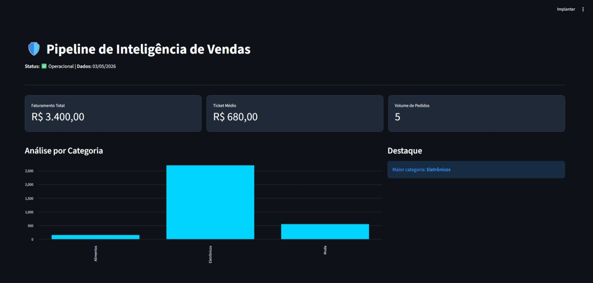
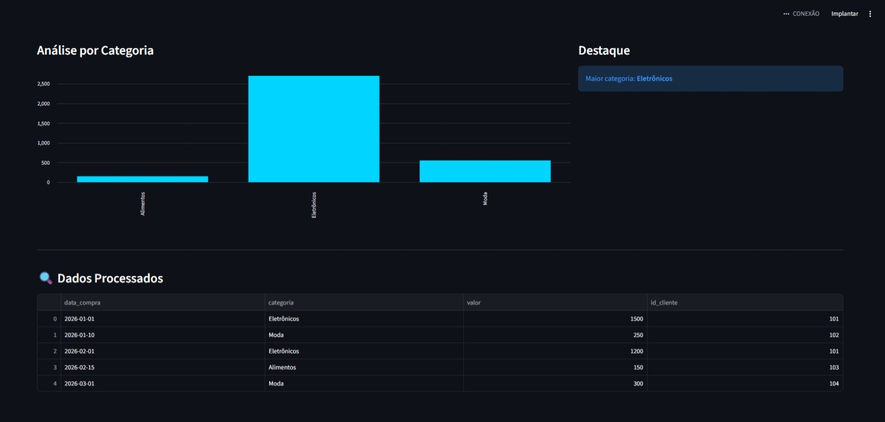

# 🛡️ Pipeline de Inteligência de Vendas - 2026

Projeto de Engenharia de Dados para automação de análise de vendas.

## 📊 Visualização do Dashboard

## 🛠️ Tecnologias
* **Python/Pandas**: Processamento e limpeza de dados.
* **Streamlit**: Dashboard interativo e métricas.

## 📂 Estrutura
* `/scripts`: Lógica do pipeline.
* `/data`: Armazenamento de CSVs.

Desenvolvido por **Otávio** (3º semestre de ADS).